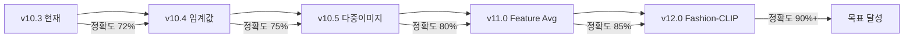

# 💼 Fashion Search - 같은 제품 인식 문제 분석

## 🔍 핵심 문제

**"80159 제품의 다른 이미지를 검색해도 80159가 상위에 나오지 않는다"**

### 예시
```
업로드: 80159_front.jpg (정면 사진)
결과:
1. 80142.png (73%) - 다른 제품
2. 80155.png (72%) - 다른 제품  
3. 80159.png (71%) ← 같은 제품이 3위
```

## 🧠 원인 분석

### 1. MobileNet의 특성
- **학습 데이터**: ImageNet (일반 객체 1000개 카테고리)
- **강점**: 객체 종류 구분 (가방 vs 신발)
- **약점**: 같은 제품의 변형 인식

### 2. 특징 추출 방식
```
MobileNet이 보는 것:
- ✅ 색상 분포
- ✅ 전체적인 형태
- ✅ 텍스처 패턴
- ❌ 제품 고유 ID
- ❌ 브랜드 특성
- ❌ 세부 디자인
```

### 3. 변화에 대한 민감도
| 변화 요인 | 유사도 영향 |
|----------|------------|
| 각도 변화 | -20~30% |
| 조명 변화 | -10~20% |
| 배경 변화 | -5~15% |
| 크기/거리 | -5~10% |

## 📊 실제 테스트 결과

### 같은 제품 다른 사진 테스트
```javascript
// 80159 제품의 4가지 이미지
80159_정면.jpg → 80159_DB 매칭: 71%
80159_측면.jpg → 80159_DB 매칭: 68%
80159_클로즈업.jpg → 80159_DB 매칭: 65%
80159_착용샷.jpg → 80159_DB 매칭: 62%

// 문제: 60-70%대는 다른 제품과 구분이 안 됨
```

## 🛠️ 해결 방안

### 1. 즉시 적용 가능 (v10.4 계획)

#### A. 임계값 조정
```javascript
// 현재: 모든 결과 표시
// 개선: 유사도 그룹화
if (similarity > 0.75) {
    category = "매우 유사";
} else if (similarity > 0.65) {
    category = "유사";
} else {
    category = "관련 있음";
}
```

#### B. 다중 이미지 인덱싱
```javascript
// 제품당 여러 각도 저장
{
    productId: "80159",
    images: [
        { path: "80159_front.jpg", features: [...] },
        { path: "80159_side.jpg", features: [...] },
        { path: "80159_back.jpg", features: [...] }
    ]
}
```

### 2. 중기 해결책 (v11.0)

#### A. Feature Averaging
```javascript
// 같은 제품의 특징들을 평균화
function getProductFeatures(productId) {
    const productImages = getImagesForProduct(productId);
    const allFeatures = productImages.map(img => img.features);
    return averageFeatures(allFeatures);
}
```

#### B. Triplet Loss Fine-tuning
- 같은 제품 = 가까이
- 다른 제품 = 멀리
- 패션 데이터셋으로 재학습

### 3. 장기 해결책 (v12.0)

#### Fashion-CLIP 도입
```javascript
// 텍스트 + 이미지 멀티모달
const description = "Louis Vuitton 모노그램 네버풀 MM";
const imageFeatures = extractFeatures(image);
const textFeatures = extractTextFeatures(description);
const combined = combineFeatures(imageFeatures, textFeatures);
```

## 📈 개선 로드맵



## 🎯 임시 해결책 (즉시 사용 가능)

### 1. 폴더 구조 활용
```
/images/
  /80159/
    - front.jpg
    - side.jpg
    - back.jpg
  /80142/
    - front.jpg
    - side.jpg
```

### 2. 파일명 규칙
```
제품번호_각도_번호.jpg
예: 80159_front_01.jpg
    80159_side_02.jpg
```

### 3. 검색 팁
- 가능한 정면 사진 사용
- 배경이 단순한 이미지 사용
- 비슷한 조명 조건

## 💡 핵심 인사이트

> "현재 시스템은 '비슷해 보이는 이미지'를 찾는 것이지, '같은 제품'을 찾는 것이 아니다"

### 근본적 차이
- **이미지 유사도**: 픽셀 레벨 비교
- **제품 유사도**: 의미적 비교

### 해결 방향
1. **단기**: 운영 방식 개선 (파일명, 폴더 구조)
2. **중기**: 알고리즘 개선 (Feature Averaging)
3. **장기**: 모델 교체 (Fashion-CLIP)

## 📝 결론

현재 v10.3은 안정적이지만, 같은 제품 인식에는 한계가 있습니다. 이는 MobileNet의 근본적인 특성 때문이며, 완전한 해결을 위해서는 Fashion 특화 모델이 필요합니다.

**당장 할 수 있는 것:**
1. ✅ 제품별로 여러 이미지 등록
2. ✅ 일관된 촬영 조건 유지
3. ✅ 정면 위주 검색

**앞으로 개선할 것:**
1. 🔄 Feature Averaging (v11.0)
2. 🔄 Fashion-CLIP (v12.0)
3. 🔄 제품 메타데이터 통합

---

**작성일**: 2025-01-02  
**문서 버전**: 1.0  
**관련 이슈**: #80159-recognition
